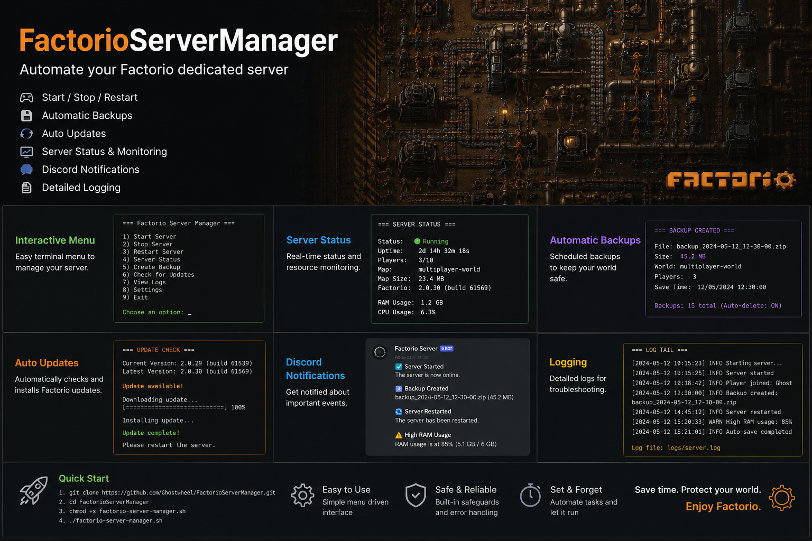

<div align="center">
  <h1>⚙️ Factorio Server Manager</h1>
  <p><em>A lightweight, elegant PowerShell-based GUI script to manage your Factorio Dedicated Server on Windows.</em></p>

  

  [](#)
  [](#)
  [](#)
</div>

---

## 📖 Table of Contents
- [✨ Features](#-features)
- [🚀 Quick Start](#-quick-start)
- [🛠️ Usage \& Options](#️-usage--options)
- [📦 Requirements](#-requirements)
- [🦇 Alternative: Batch Script](#-alternative-batch-script)

---

## ✨ Features

- 📥 **Auto-install/update:** Effortlessly downloads and extracts the latest Factorio server binary.
- 💾 **Save File Management:** Launch your server using the latest save file, manually pick one via a GUI window, or generate a fresh new save directly!
- ⚙️ **Easy Configuration:** Edit `server-settings.json` and `server-adminlist.json` directly with Notepad through the manager. Configuration files are safely stored at the root of the repository, ensuring they persist across updates. The script dynamically loads these settings into the game on startup if they exist.
- 🔄 **Force Update Support:** A convenient menu option to purge the existing executable and forcefully re-download the latest version from Factorio.com.
- 🪶 **Zero Dependencies:** Requires nothing more than PowerShell and internet access!

---

## 🚀 Quick Start

1. **Clone or Download** this repository to your preferred location.
2. **Open PowerShell** in the directory.
3. **Run the script:**

   ```powershell
   ./FactorioServerManager.ps1
   ```

> **Note on First Run:**
> The script will automatically download and extract the latest Factorio server to `./Factorio/`. It will also copy over the default configuration file to the repository root if it is missing.

---

## 🛠️ Usage & Options

Upon launching the script, you will be presented with a menu:

```text
=========================================
      Factorio Server Manager GUI
=========================================
 1. Load latest save
 2. Choose save manually
 3. Edit server settings
 4. Edit server adminlist
 5. Create new save & launch server
 6. Force update Factorio Server
 7. Exit
=========================================
```

1. **Load latest save:** Automatically loads the most recent save file from `%APPDATA%\Factorio\saves`.
2. **Choose save manually:** Opens a window to manually select the save file you want to load.
3. **Edit server settings:** Opens `server-settings.json` in Notepad for quick modifications. (Uses `--server-settings` parameter when launching).
4. **Edit server adminlist:** Opens `server-adminlist.json` in Notepad for quick modifications. (Uses `--server-adminlist` parameter when launching).
5. **Create new save & launch server:** Generates a fresh `.zip` save dynamically before starting the server.
6. **Force update Factorio Server:** Re-downloads and updates the executable.
7. **Exit:** Closes the manager.

---

## 📦 Requirements

To run this manager smoothly, ensure your system meets the following criteria:

- 🪟 **OS:** Windows 10 or Windows 11
- 💻 **Shell:** PowerShell 5.1 or newer
- 🌐 **Network:** Internet access (required for the first-time setup and downloads)

---

## 🦇 Alternative: Batch Script

If you prefer using a standard Windows Batch script instead of PowerShell, an alternative is provided!

Simply run:
```cmd
example_batch.bat
```
This script offers matching functionality for save file management, server startup, setting generation, and save creation, tailored for a standard batch environment.

---

<div align="center">
  <p>Built with ❤️ for Factorio server admins.</p>
  <p>GitHub: <a href="https://github.com/GhostwheeI/FactorioServerManager">GhostwheeI/FactorioServerManager</a></p>
</div>
